# Corporate Roguelike Character Design Book

This design book defines the core cast for a whimsical 8-bit corporate roguelike deck-builder. It is built to be reused as a prompt source for Claude or any future implementation pass.

Core premise: a tiny office worker is trapped inside a cursed corporate org chart, fighting workplace meme monsters with cards that read like fictional Reddit posts.

## Individual Sprite Index

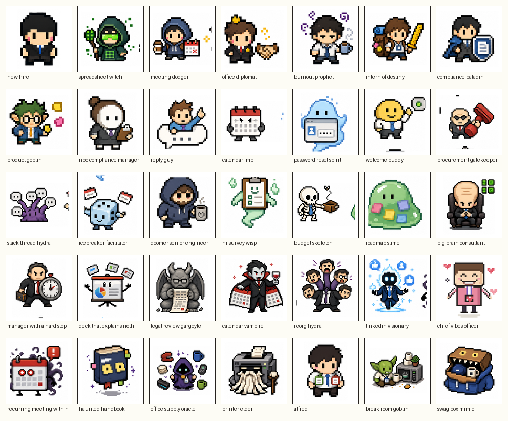

## Design Rules

- Visual style: simple 8-bit pixel art, chunky square pixels, flat colors, bold dark outlines, big heads, tiny bodies, simple vertical eyes.
- Art target: the overview contact sheets in this folder are the primary visual direction. Individual PNGs are cut to preserve the same charm, proportions, expressive silhouettes, readable props, and richer color blocking as the sheets.
- Individual PNG rule: these are concept sprites, not final animation sheets. They may be larger and more expressive than production sprites as long as the design remains readable when simplified later.
- Silhouette rule: every character needs one readable shape hook: badge, clipboard, calendar cape, stamp, hoodie, shield, giant forehead, slide deck, or living box.
- Comedy rule: every character must have a joke and a gameplay purpose.
- Mechanics rule: a character should imply how it plays before the player reads the text.
- Writing style: specific, petty, whimsical, workplace Reddit-style, and unserious.
- Avoid: flat programmatic placeholders, sterile geometric icons, polished anime, detailed fantasy rendering, generic corporate filler, direct copies of Slay the Spire characters, direct meme-image copies, and UI that looks like a SaaS dashboard.

Claude may add new characters, cards, relics, items, statuses, and events if they follow these rules and improve strategy, comedy, or story. All future characters and items must follow the same whimsical corporate pixel-fantasy direction established by the contact sheets.

## Eye Color System

Eye color is used as a fast identity cue, not realism. Major playable characters should have visibly different eye colors when the sprite size allows it. Enemy and NPC eye colors should reinforce role: red for time-draining threats, pink for HR/social pressure, cyan for machines and magic systems, gold for authority or money, green for spreadsheet/product logic, lavender for burnout or strange prophecy, and gray-blue for Alfred's unstable department identity. Eye color is secondary to silhouette and prop clarity.

## Anchor Hero

### The New Hire

- **Role:** Default playable hero.
- **Visual Design:** Tiny black-haired business-suit worker with black side-swept hair, black suit jacket, white shirt, blue tie, pink cheek pixels, simple vertical eyes, and chunky dark outline.
- **Eye Color:** blue-black.
- **Background Story:** The New Hire started the morning expecting a normal onboarding session and a confusing benefits portal. Instead, the elevator opened into the Infinite Org Chart, a living corporate tower where departments fold into each other and meetings summon enemies. They still do not have dashboard access, but they have learned that a calendar conflict can block psychic damage if timed correctly.
- **Personality:** Polite, observant, overwhelmed, slowly becoming dangerous.
- **Gameplay Identity:** Balanced starter. Teaches attacks, block, draw, status effects, and enemy intent reading.
- **Sample Line:** "I thought onboarding was one day."
- **Pixel Notes:** Keep the blue tie and cheek pixels visible at small size. The hair silhouette is the identity anchor.

## Playable Heroes

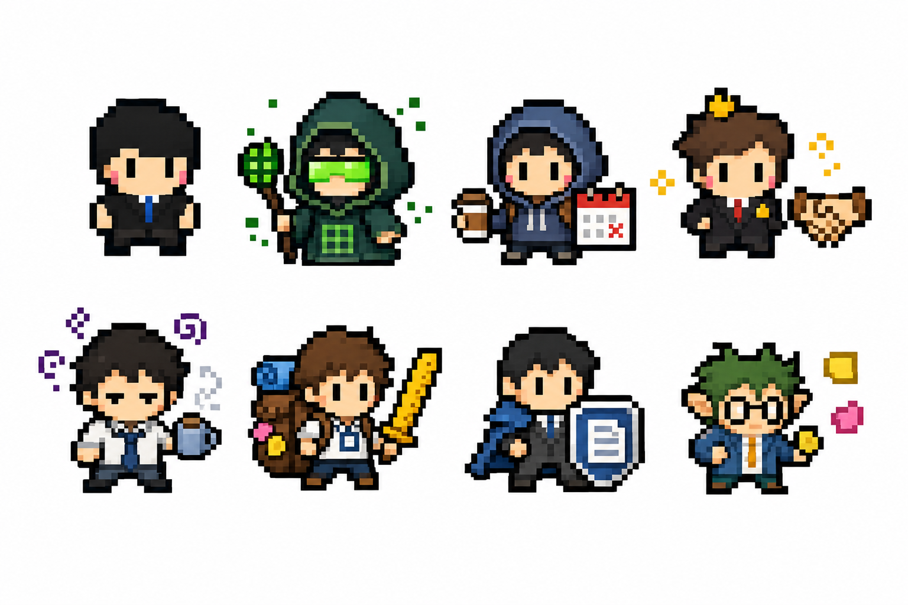

Contact sheet order: New Hire, Spreadsheet Witch, Meeting Dodger, Office Diplomat, Burnout Prophet, Intern of Destiny, Compliance Paladin, Product Goblin.

### Spreadsheet Witch

- **Role:** Playable combo caster.
- **Visual Design:** Green visor, robe patterned like spreadsheet cells, tiny floating grid, sharp green accent colors.
- **Eye Color:** green.
- **Background Story:** The Spreadsheet Witch was once an analyst who stared too long into a broken pivot table and heard it whisper quarterly truths. She now treats formulas like spells and formatting errors like omens. Nobody knows her real name because every file she touches becomes `final_FINAL_v7_reallyfinal.xlsx`.
- **Personality:** Exacting, suspicious, dry, convinced cells have motives.
- **Gameplay Identity:** Multi-hit attacks, Focus scaling, draw chains, spreadsheet combo math.
- **Sample Line:** "The formula is wrong, but the confidence interval is intimidating."
- **Pixel Notes:** Use the visor and floating grid as the silhouette hooks.

### Meeting Dodger

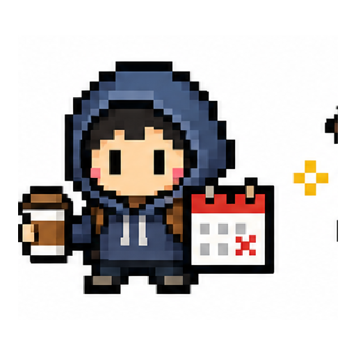

- **Role:** Playable evasion and exhaust specialist.
- **Visual Design:** Hoodie over office clothes, coffee cup, fake calendar invite, sneakers.
- **Eye Color:** warm brown.
- **Background Story:** The Meeting Dodger survived three reorgs by becoming functionally invisible. They have mastered calendar camouflage, fake "focus blocks," and the sacred art of declining without saying no. The org chart lists them as optional, which is the highest known form of freedom.
- **Personality:** Clever, avoidant, calm under nonsense.
- **Gameplay Identity:** Exhausts junk cards, manipulates enemy intent, blocks through avoidance.
- **Sample Line:** "I have a conflict called not doing this."
- **Pixel Notes:** Hoodie plus coffee cup should read before any smaller details.

### Office Diplomat

- **Role:** Playable debuff and Influence controller.
- **Visual Design:** Cute suit, tiny crown pin, clipboard, handshake icon or small social aura.
- **Eye Color:** gold.
- **Background Story:** The Office Diplomat smiles with the force of a legal document. They can make a room feel aligned without anyone agreeing, and they have never once answered a question directly. Their greatest weapon is saying "great point" while removing all practical meaning from the conversation.
- **Personality:** Charming, precise, socially dangerous.
- **Gameplay Identity:** Influence generation, Weak, Vulnerable, enemy debuffs, intent punishment.
- **Sample Line:** "I think we are violently aligned."
- **Pixel Notes:** Crown pin and clipboard separate the character from the New Hire.

### Burnout Prophet

- **Role:** Playable risk/reward scaler.
- **Visual Design:** Loose tie, tired eyes, messy hair, glowing coffee cup.
- **Eye Color:** tired lavender.
- **Background Story:** The Burnout Prophet has seen every roadmap collapse and every "quick win" become a migration project. Their coffee glows because it contains every deadline they have survived. They do not predict the future so much as remember the next bad meeting before it happens.
- **Personality:** Tired, prophetic, blunt, accidentally wise.
- **Gameplay Identity:** Self-damage, Anxiety management, large scaling if surviving pressure.
- **Sample Line:** "The demo will fail in a new and educational way."
- **Pixel Notes:** Keep the coffee cup bright. Tired eyes are the face read.

### Intern of Destiny

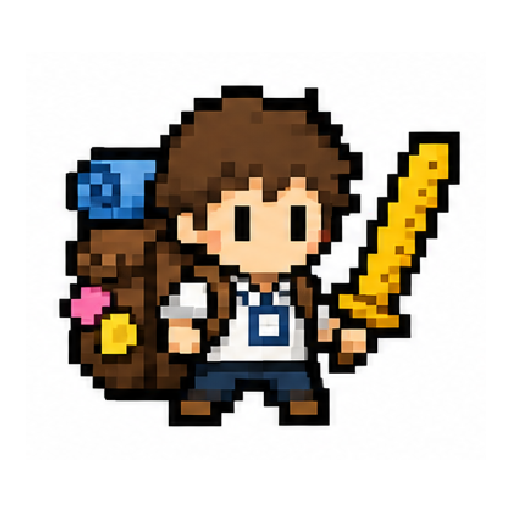

- **Role:** Playable chaotic learner.
- **Visual Design:** Oversized backpack, enormous badge, ruler sword, nervous stance.
- **Eye Color:** bright teal.
- **Background Story:** The Intern of Destiny joined for experience and accidentally became load-bearing infrastructure. Every senior person assumes someone else trained them. The badge is too large because the system generated six identities and merged them into one extremely employable mistake.
- **Personality:** Earnest, anxious, lucky, more powerful than expected.
- **Gameplay Identity:** Cheap cards, generated cards, random upgrades, growth from mistakes.
- **Sample Line:** "Is production the one with customers in it?"
- **Pixel Notes:** Oversized backpack and badge should exaggerate the silhouette.

### Compliance Paladin

- **Role:** Playable defensive tank.
- **Visual Design:** Business armor, policy-document shield, neat hair, tiny rulebook.
- **Eye Color:** steel blue.
- **Background Story:** The Compliance Paladin believes there is a form for every wound and a policy for every curse. They entered the Infinite Org Chart to prove that process can protect people. So far, process has mostly applied Frail, but the shield is holding.
- **Personality:** Earnest, lawful, protective, occasionally terrifying.
- **Gameplay Identity:** Heavy block, reflect damage, turns curses and statuses into defense.
- **Sample Line:** "Please route your attack through the approved intake channel."
- **Pixel Notes:** The shield must look like a document, not a fantasy shield.

### Product Goblin

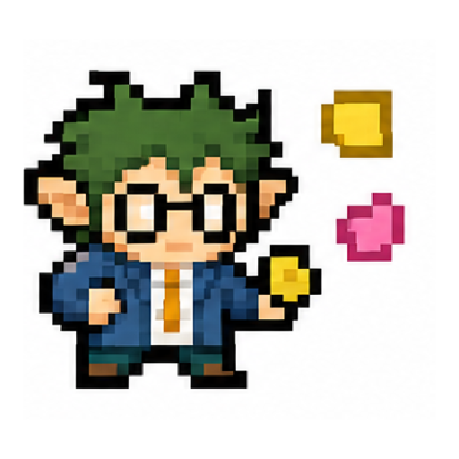

- **Role:** Playable improviser.
- **Visual Design:** Tiny blazer, sticky notes everywhere, roadmap scroll, frantic eyes.
- **Eye Color:** orange.
- **Background Story:** The Product Goblin emerged from a backlog that nobody groomed. It speaks in MVPs, experiments, and "just enough discovery." Nobody knows whether it is an employee or a Jira ticket that learned to stand upright.
- **Personality:** Chaotic, clever, fast-talking, optimistic under bad evidence.
- **Gameplay Identity:** Draw/discard engine, temporary cards, flexible short-term plays.
- **Sample Line:** "What if we ship the problem and validate feelings?"
- **Pixel Notes:** Sticky notes should be the main color blocks.

## Normal Enemies

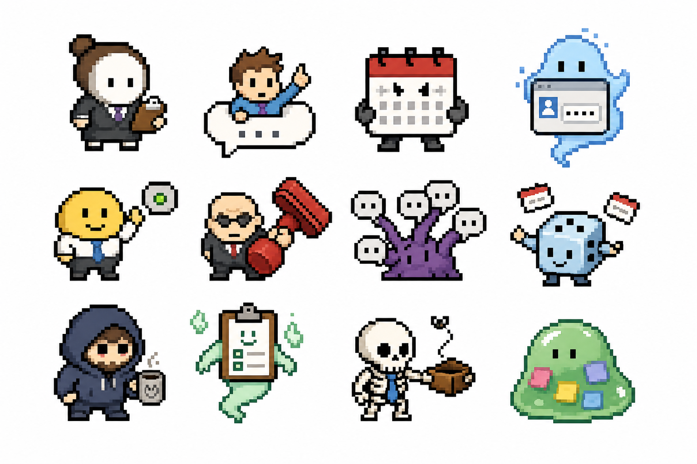

Contact sheet includes: NPC Compliance Manager, Reply Guy, Calendar Imp, Password Reset Spirit, Welcome Buddy, Procurement Gatekeeper, Slack Thread Hydra, Icebreaker Facilitator, Doomer Senior Engineer, HR Survey Wisp, Budget Skeleton, Roadmap Slime.

### NPC Compliance Manager

- **Role:** Defensive tutorial enemy.
- **Visual Design:** Blank face, gray suit, clipboard, dead pixel eyes.
- **Eye Color:** muted teal-gray.
- **Background Story:** The Compliance Manager patrols Onboarding Wastes with a clipboard full of forms nobody can complete. It does not hate the player. It simply cannot recognize human distress unless filed in the correct field.
- **Mechanic Identity:** Gains Block, applies Doubt, adds Training Module or Meeting Invite cards.
- **Sample Line:** "Per policy, morale must be documented."
- **Pixel Notes:** Keep the clipboard large enough to read.

### Reply Guy

- **Role:** Annoyance and interrupt enemy.
- **Visual Design:** Tiny head emerging from a Slack bubble.
- **Eye Color:** chat cyan.
- **Background Story:** Reply Guy appears whenever a thread is almost useful. He has never owned a deliverable, but he has many clarifying questions. His comments are small, persistent, and always technically adjacent.
- **Mechanic Identity:** Applies Weak, interrupts setup, adds small junk.
- **Sample Line:** "Just curious, have we considered the obvious?"
- **Pixel Notes:** Chat bubble is the silhouette.

### Calendar Imp

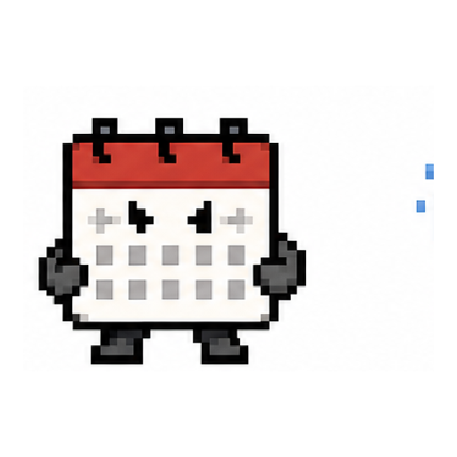

- **Role:** Junk-card enemy.
- **Visual Design:** Small demon with calendar square and red notification pixels.
- **Eye Color:** hot yellow.
- **Background Story:** Calendar Imps hatch from recurring invites with no agenda. They travel in packs, looking for open slots and emotional vulnerability.
- **Mechanic Identity:** Adds Meeting Invites and chips HP with small attacks.
- **Sample Line:** "I found thirty minutes."
- **Pixel Notes:** Calendar square should be red or bright enough to identify.

### Password Reset Spirit

- **Role:** Energy disruption enemy.
- **Visual Design:** Floating login box ghost with tiny eyes.
- **Eye Color:** login cyan.
- **Background Story:** The Password Reset Spirit guards access to tools the player already requested. It only appears when the enemy is about to attack and the player has finally drawn the right card.
- **Mechanic Identity:** Applies Confused, drains Energy, occasionally blocks behind authentication.
- **Sample Line:** "Your session expired during combat."
- **Pixel Notes:** Make it boxy and spectral, not humanoid.

### Welcome Buddy Who Is Never Online

- **Role:** Evasive blocker.
- **Visual Design:** Friendly worker with away-status bubble.
- **Eye Color:** friendly blue.
- **Background Story:** The Welcome Buddy was assigned to help every New Hire and then immediately entered a permanent meeting. Their smile is real. Their availability is not.
- **Mechanic Identity:** Blocks, dodges, applies Doubt, occasionally vanishes behind Away status.
- **Sample Line:** "Ping me anytime."
- **Pixel Notes:** Away-status bubble must be obvious.

### Procurement Gatekeeper

- **Role:** Expensive-card punisher.
- **Visual Design:** Angry office worker with oversized red DENIED-style stamp, no readable text required.
- **Eye Color:** stamp red.
- **Background Story:** The Gatekeeper stands before the Office Supply Closet and judges every purchase over nineteen dollars. It can smell unapproved spend from three departments away.
- **Mechanic Identity:** Gains Block, punishes high-cost cards, reduces Budget rewards.
- **Sample Line:** "Denied. Please submit a business case."
- **Pixel Notes:** Red stamp is the main prop.

### Slack Thread Hydra

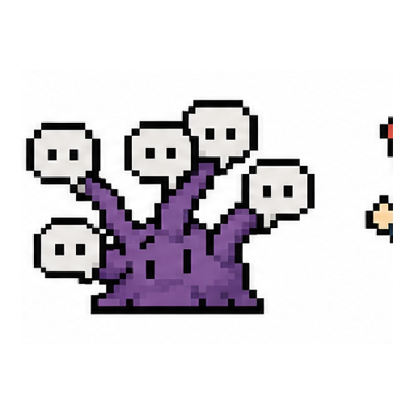

- **Role:** Multi-hit and escalation enemy.
- **Visual Design:** Cluster of chat bubbles with little faces.
- **Eye Color:** notification cyan.
- **Background Story:** The Slack Thread Hydra begins as one question and becomes fourteen subthreads, three misunderstandings, and one unexplained emoji reaction from leadership.
- **Mechanic Identity:** Multi-hit attacks, grows replies, adds junk, scales if ignored.
- **Sample Line:** "Looping in three more people."
- **Pixel Notes:** Use multiple bubble heads instead of a monster body.

### Icebreaker Facilitator

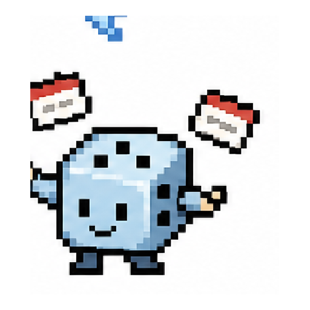

- **Role:** Vulnerable and forced-fun enemy.
- **Visual Design:** Cheerful sprite with name tags and dice.
- **Eye Color:** forced-fun cyan.
- **Background Story:** The Facilitator appears before every training session and demands one fun fact and one fear. It feeds on sincerity and awkward silence.
- **Mechanic Identity:** Applies Vulnerable, weak attacks, buffs itself after forced sharing.
- **Sample Line:** "Say one fun fact and one fear."
- **Pixel Notes:** Big smile plus name tag should make it readable.

### Doomer Senior Engineer

- **Role:** Power-card punisher.
- **Visual Design:** Hoodie, cold coffee, shadowed eyes.
- **Eye Color:** dull lavender.
- **Background Story:** The Doomer Senior Engineer has watched every initiative return with a new acronym and the same database. They are usually right, which makes them worse.
- **Mechanic Identity:** Punishes Powers, gains Legacy Knowledge Block, applies Anxiety.
- **Sample Line:** "We tried this in 2017."
- **Pixel Notes:** Hoodie and coffee are required.

### HR Survey Wisp

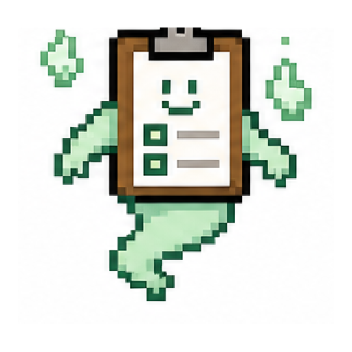

- **Role:** Debuff and Doubt enemy.
- **Visual Design:** Floating clipboard with fake smile icon.
- **Eye Color:** survey pink.
- **Background Story:** The Survey Wisp promises anonymity while asking for department, manager, location, tenure, and writing sample. It drifts through the halls collecting psychological safety essays.
- **Mechanic Identity:** Adds Doubt, applies Anxiety, sometimes heals from debuffs.
- **Sample Line:** "This is anonymous. Please log in."
- **Pixel Notes:** Clipboard should look suspiciously cheerful.

### Budget Skeleton

- **Role:** Economy pressure enemy.
- **Visual Design:** Skeleton in tie holding empty wallet.
- **Eye Color:** budget gold.
- **Background Story:** The Budget Skeleton died during planning season but continued approving headcount assumptions. It rattles when someone says "stretch goal."
- **Mechanic Identity:** Steals Budget, applies Frail, weakens shop pathing.
- **Sample Line:** "There is no money, but plenty of expectations."
- **Pixel Notes:** Wallet and tie carry the joke.

### Roadmap Slime

- **Role:** Splitting task enemy.
- **Visual Design:** Green blob with sticky notes suspended inside.
- **Eye Color:** product teal.
- **Background Story:** Roadmap Slime forms when one feature is described as "just a small follow-up." Hitting it reveals dependencies nobody documented.
- **Mechanic Identity:** Splits into smaller tasks, clogs deck with Action Items, punishes unfocused damage.
- **Sample Line:** "This is actually three projects."
- **Pixel Notes:** Sticky notes inside the slime are the visual hook.

## Elites and Bosses

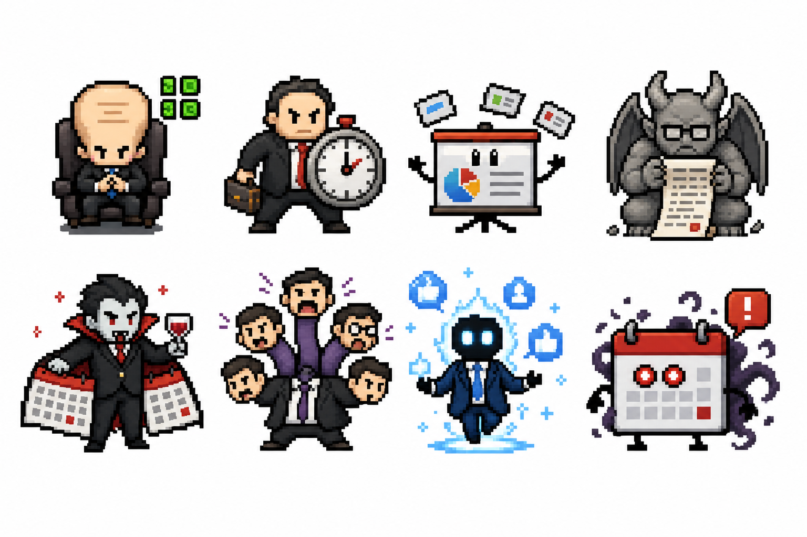

Contact sheet includes: Big Brain Consultant, Manager With A Hard Stop, Living Deck That Explains Nothing, Legal Review Gargoyle, Calendar Vampire, Reorg Hydra, LinkedIn Visionary, Recurring Meeting With No End Date.

### Big Brain Consultant

- **Role:** Elite debuff strategist.
- **Visual Design:** Huge forehead, tiny suit, floating 2x2 matrix.
- **Eye Color:** consultant purple.
- **Background Story:** The Big Brain Consultant was summoned by a budget surplus and a vague executive concern. It solves every problem with a diagram, including problems caused by previous diagrams. Nobody understands the matrix, but everyone agrees it feels expensive.
- **Mechanic Identity:** Applies Confused and Vulnerable, buffs itself with Framework, punishes random card play.
- **Sample Line:** "Let us solve this with a diagram nobody requested."
- **Pixel Notes:** Giant head plus matrix icon must read immediately.

### Manager With A Hard Stop

- **Role:** Elite timing test.
- **Visual Design:** Manager carrying clock shield, tense posture.
- **Eye Color:** deadline orange.
- **Background Story:** This manager has a hard stop in six minutes and will spend all six dealing damage. They open every fight by saying they will be brief, then schedules follow-ups with your HP bar.
- **Mechanic Identity:** Telegraphs large attacks, alternates between clock-block and burst damage.
- **Sample Line:** "I have a hard stop, so I will be brief and damaging."
- **Pixel Notes:** Clock shield should be the silhouette anchor.

### The Deck That Explains Nothing

- **Role:** Elite adaptability test.
- **Visual Design:** Living slide deck with eyes, page tabs, and pointer.
- **Eye Color:** slide purple.
- **Background Story:** Nobody created this deck. It appeared in a shared drive already marked final. Each slide contradicts the last, but the transitions are beautiful.
- **Mechanic Identity:** Cycles buff, debuff, block, and attack intents; changes behavior every few turns.
- **Sample Line:** "The answer is on slide 47."
- **Pixel Notes:** Make the body a stack of slides, not a humanoid.

### Legal Review Gargoyle

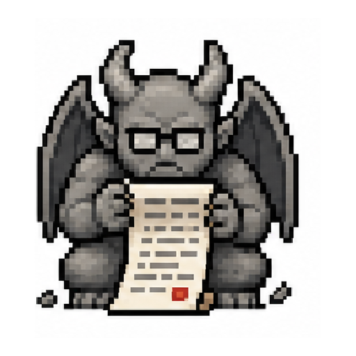

- **Role:** Elite constraint enemy.
- **Visual Design:** Stone gargoyle with fine-print scroll.
- **Eye Color:** legal yellow.
- **Background Story:** The Gargoyle sleeps above every launch checklist and wakes when someone says "probably fine." It adds comments that cannot be resolved because they are technically correct.
- **Mechanic Identity:** Adds Corporate Debt, punishes generated cards, slows combo decks.
- **Sample Line:** "Approved, pending irreversible edits."
- **Pixel Notes:** Stone gray plus scroll shape.

### Calendar Vampire

- **Role:** Act boss or major elite.
- **Visual Design:** Vampire manager, cape made of calendar pages, red notification eyes.
- **Eye Color:** calendar red.
- **Background Story:** The Calendar Vampire descends from a recurring invite titled "Quick Touchbase." It feeds on open time, unfinished sentences, and the lie that everyone will get five minutes back.
- **Mechanic Identity:** Adds Meeting Invites, drains Energy, gains Strength for Meeting Invites in hand.
- **Sample Line:** "This should only take fifteen minutes."
- **Defeat Line:** "The invite remains on your calendar, but now it says optional."
- **Pixel Notes:** Calendar cape must be visible at small size.

### Reorg Hydra

- **Role:** Boss with multiple intents.
- **Visual Design:** Multi-headed manager monster, each head with a different title badge.
- **Eye Color:** reorg orange.
- **Background Story:** The Reorg Hydra claims it is simplifying the structure while growing new reporting lines. Each head owns a different priority and none of them own the decision.
- **Mechanic Identity:** Multiple intents, pattern shifts, Confusion and Doubt, escalating mid-fight.
- **Sample Line:** "We are simplifying the org structure," says the seventh head.
- **Pixel Notes:** Keep heads simple and readable, not over-detailed.

### LinkedIn Visionary

- **Role:** Scaling boss.
- **Visual Design:** Glowing suit, motivational post halo, tiny phone or podium.
- **Eye Color:** cold cyan.
- **Background Story:** The Visionary has never used the product but has strong thoughts about transformation. Its posts deal psychic damage because they almost mean something.
- **Mechanic Identity:** Scales every few turns, applies Vulnerable, punishes slow decks.
- **Sample Line:** "Execution is just strategy with shoes."
- **Pixel Notes:** Halo should be abstract sparkle/posts, not a logo.

### Chief Vibes Officer

- **Role:** Culture-debuff boss.
- **Visual Design:** Cheerful executive sprite with heart icons and too-wide smile.
- **Eye Color:** weaponized pink.
- **Background Story:** The Chief Vibes Officer weaponizes positivity until resistance sounds like a personal failing. Their attacks arrive wrapped in gratitude and optional mandatory attendance.
- **Mechanic Identity:** Applies guilt statuses, converts Block into Resistance to Change, pressures defensive decks.
- **Sample Line:** "Bring your whole self, but make it billable."
- **Pixel Notes:** Cute hearts plus unsettling smile.

### The Recurring Meeting With No End Date

- **Role:** Final boss candidate.
- **Visual Design:** Sentient calendar invite with notification eyes.
- **Eye Color:** notification red.
- **Background Story:** The Recurring Meeting has survived layoffs, migrations, and three calendar platforms. Nobody remembers who created it. Everyone accepts it. It has no agenda because the agenda is the player.
- **Mechanic Identity:** Adds Meeting Invites every turn, revives unless enough meetings are exhausted, tests deck control.
- **Sample Line:** "This meeting has been updated. No action is required."
- **Pixel Notes:** Calendar body plus notification eyes. No humanoid needed.

## Friendly NPCs

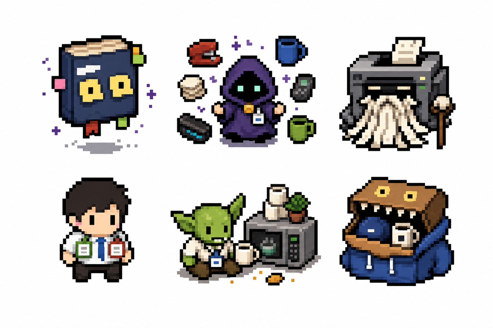

Contact sheet includes: Haunted Handbook, Office Supply Oracle, Printer Elder, Alfred, Break Room Goblin, Swag Box Mimic.

### Haunted Handbook

- **Role:** Tutorial guide.
- **Visual Design:** Floating employee handbook with sticky-note eyes.
- **Eye Color:** policy green.
- **Background Story:** The Haunted Handbook welcomes every New Hire with cheerful policy language and a complete lack of concern for the screaming in the calendar. It knows the rules of the tower but is contractually obligated to phrase them as onboarding tips.
- **Mechanic Identity:** Explains mechanics, gives contextual hints, occasionally unlocks lore.
- **Sample Line:** "Tip: Block prevents damage. PTO would too, but that system is down."
- **Pixel Notes:** Book shape and sticky eyes are mandatory.

### Office Supply Oracle

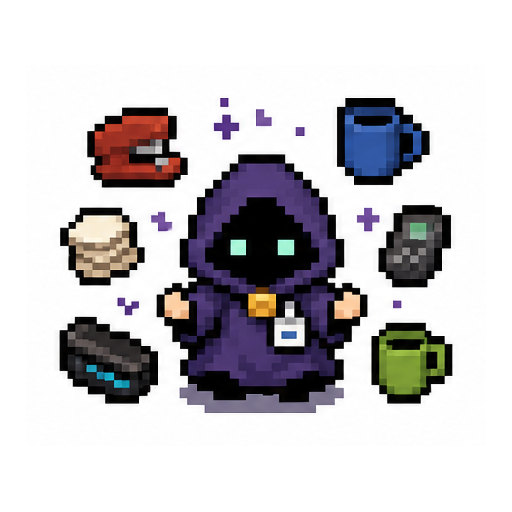

- **Role:** Shopkeeper.
- **Visual Design:** Tiny robe, staplers, mugs, forbidden toner.
- **Eye Color:** supply gold.
- **Background Story:** The Oracle runs the Office Supply Closet, which accepts Budget, secrets, and one unspoken favor. It knows which relics Procurement has not noticed yet.
- **Mechanic Identity:** Sells cards, removes cards, offers Office Artifacts.
- **Sample Line:** "Budget is a social construct until Procurement arrives."
- **Pixel Notes:** Surround with a few tiny supply icons.

### Printer Elder

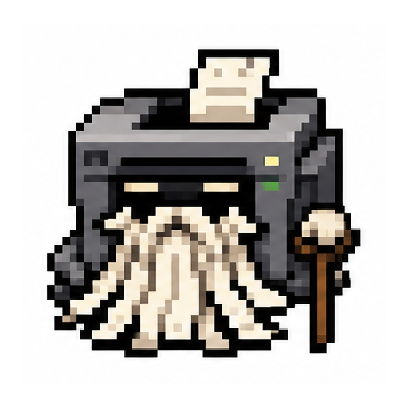

- **Role:** Rest and training NPC.
- **Visual Design:** Ancient printer with paper-jam beard.
- **Eye Color:** cyan indicator lights.
- **Background Story:** The Printer Elder predates the company and possibly paper. It can upgrade cards by printing comments in the margins, but every gift comes with a soft grinding sound.
- **Mechanic Identity:** Rest, upgrade, preview, or occasional cursed event.
- **Sample Line:** "I have printed things your managers have forgotten."
- **Pixel Notes:** Paper beard is the identity hook.

### Alfred

- **Role:** Recurring mystery NPC.
- **Visual Design:** Ordinary office worker with mismatched department badges; slightly different each appearance.
- **Eye Color:** gray-blue.
- **Background Story:** Alfred appears in every department with a different badge and the same quiet confidence. He may be Finance, IT, Operations, or a rumor the org chart uses to speak. He never explains why he knows the next boss mechanic.
- **Mechanic Identity:** Hints at upcoming encounters, unlocks alternate paths, trades secrets for small costs.
- **Sample Line:** "I am not in the org chart. The org chart is in me."
- **Pixel Notes:** Badge changes between appearances. Keep the base silhouette ordinary.

### Break Room Goblin

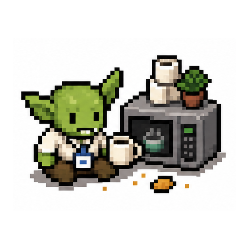

- **Role:** Rest and event NPC.
- **Visual Design:** Small goblin-like office worker with badge, microwave, and snack crumbs.
- **Eye Color:** snack orange.
- **Background Story:** The Break Room Goblin lives behind the microwave and keeps a ledger of stolen lunches. It is petty, useful, and has strong opinions about reheated fish.
- **Mechanic Identity:** Offers healing, small buffs, or risky food events.
- **Sample Line:** "Someone microwaved fish. Gain 1 Anxiety."
- **Pixel Notes:** Microwave or mug should appear nearby.

### Swag Box Mimic

- **Role:** Treasure and event NPC.
- **Visual Design:** Cardboard box with teeth, company hoodie, and suspicious smile.
- **Eye Color:** swag gold.
- **Background Story:** The Swag Box Mimic appears after high-visibility meetings, offering hoodies, stickers, and extremely conditional morale. Sometimes it contains treasure. Sometimes it contains culture.
- **Mechanic Identity:** Treasure node with risk/reward item choices.
- **Sample Line:** "Take the hoodie. It has culture on it."
- **Pixel Notes:** Teeth plus hoodie make the joke read.

## Item and Relic Expansion Rules

Relic-like rewards should be called **Office Artifacts**, **Survival Perks**, **Desk Relics**, or **Forbidden Supplies**. They should support strategy and jokes at the same time.

Good examples:

- **Noise-Canceling Headphones:** Start each combat with 4 Block.
- **Manager's Favorite Mug:** Gain 1 extra Energy on turn 1.
- **Old Project Wiki:** Draw 1 extra card after playing your first Skill each turn.
- **Calendar Immunity:** The first Meeting Invite each combat is Exhausted automatically.
- **Suspicious Promotion:** Gain 1 Strength at combat start. Add 1 Anxiety to your deck.
- **Inbox Zero:** Whenever you Exhaust a Status card, draw 1 card.
- **Meeting-Free Friday:** Every fifth turn, gain 2 Energy.
- **Alfred's Old Badge:** Once per act, choose a locked path on the map.

## Handoff Notes for Claude

When expanding this cast:

- Add content only if it improves gameplay, comedy, or lore.
- Every new enemy needs intent names and at least one mechanical pressure.
- Every new boss needs a unique mechanic, not just more HP.
- Every new playable character needs a starter deck, starting perk, and clear strategy.
- Every new item needs a reason to change player decisions.
- Replace generic lines with specific workplace satire.

Quality bar: the player should remember at least three funny enemies, three funny cards, one recurring joke, one strange lore mystery, and one boss line after a run.
